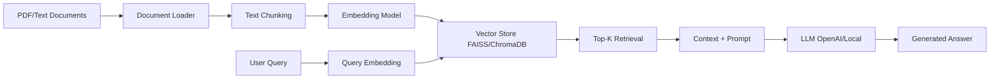

# RAG Pipeline Demo — Financial Document Q&A

> **Portfolio Project:** Production-ready Retrieval-Augmented Generation (RAG) system for querying financial documents.

**Author:** Jerzy Płocha  
**Purpose:** Demonstrate AI/ML engineering skills for senior AI/ML role interviews  
**Domain:** Financial services / Banking (leveraging 15+ years fintech expertise)

---

## 🎯 **What This Demonstrates**

- **RAG Architecture:** Document ingestion → chunking → embedding → vector store → retrieval → LLM generation
- **Production Engineering:** Clean code, proper project structure, tests, documentation
- **Domain Expertise:** Financial document processing (SEC filings, banking regulations, credit policies)
- **AI/ML Fundamentals:** Embeddings, vector search, prompt engineering, context window optimization

---

## 🏗️ **Architecture**



---

## 🚀 **Quick Start**

### Prerequisites
- Python 3.9+
- pip

### Installation

```bash
# Clone repository
git clone https://github.com/[your-username]/ml-portfolio.git
cd ml-portfolio

# Create virtual environment
python -m venv venv
source venv/bin/activate  # On Windows: venv\Scripts\activate

# Install dependencies
pip install -r requirements.txt

# Run example
python src/main.py
```

---

## 📊 **Example Usage**

```python
from src.rag_pipeline import RAGPipeline

# Initialize pipeline
rag = RAGPipeline(
    data_path="data/sec_filings",
    embedding_model="sentence-transformers/all-MiniLM-L6-v2",
    vector_store="faiss"
)

# Ingest documents
rag.ingest_documents()

# Query
answer = rag.query("What are the key credit risk factors mentioned in the 10-K filing?")
print(answer)
```

**Example Output:**
```
The 10-K filing identifies three primary credit risk factors:
1. Concentration risk in commercial real estate loans (42% of portfolio)
2. Rising interest rates impact on borrower default rates
3. Regulatory capital requirements under Basel III

Sources: [Document 12, Page 34], [Document 8, Page 19]
```

---

## 📂 **Project Structure**

```
ml-portfolio/
├── src/
│   ├── __init__.py
│   ├── main.py              # Entry point
│   ├── document_loader.py   # PDF/text ingestion
│   ├── chunker.py           # Text splitting strategies
│   ├── embedder.py          # Embedding generation
│   ├── vector_store.py      # FAISS/ChromaDB wrapper
│   ├── retriever.py         # Top-K retrieval logic
│   ├── llm.py               # LLM interface (OpenAI/local)
│   └── rag_pipeline.py      # End-to-end orchestration
├── tests/
│   ├── test_chunker.py
│   ├── test_embedder.py
│   └── test_retriever.py
├── data/
│   ├── README.md            # Dataset sources and instructions
│   └── sample_docs/         # Example documents
├── notebooks/
│   └── demo.ipynb           # Interactive demo notebook
├── docs/
│   ├── architecture.md      # Detailed architecture notes
│   └── prompt_engineering.md
├── requirements.txt
├── .gitignore
├── LICENSE
└── README.md
```

---

## 🧪 **Running Tests**

```bash
pytest tests/
```

---

## 🔧 **Configuration**

Edit `src/config.py` to customize:
- Embedding model (sentence-transformers, OpenAI)
- Vector store backend (FAISS, ChromaDB, Pinecone)
- Chunk size and overlap
- LLM provider (OpenAI GPT-4, Claude, local models)

---

## 📚 **Dataset**

This demo uses publicly available financial documents:
- SEC 10-K filings (public company annual reports)
- Federal Reserve banking regulations
- Credit policy templates

See `data/README.md` for download instructions.

---

## 🎓 **Learning Resources**

- [LangChain RAG Tutorial](https://python.langchain.com/docs/use_cases/question_answering/)
- [Vector Databases Explained](https://www.pinecone.io/learn/vector-database/)
- [Chunking Strategies](https://www.llamaindex.ai/blog/evaluating-the-ideal-chunk-size-for-a-rag-system-using-llamaindex-6207e5d3fec5)

---

## 🤝 **About the Author**

**Jerzy Płocha**  
Senior Backend Architect transitioning to AI/ML Engineering

- 15 years building scalable financial systems (Citi, Deutsche Bank, Santander, Credit Suisse)
- AWS Solutions Architect certified
- Technical Reviewer: Springer Nature's "Generative AI-Driven Application Development with Java"
- Currently: Stanford ML Specialization (Andrew Ng)

**LinkedIn:** [Your LinkedIn]  
**Portfolio:** [Your Portfolio Site]

---

## 📝 **License**

MIT License - see [LICENSE](LICENSE) for details.

---

## ⭐ **Acknowledgments**

Built with:
- [LangChain](https://github.com/langchain-ai/langchain) - RAG framework
- [FAISS](https://github.com/facebookresearch/faiss) - Vector similarity search
- [Sentence Transformers](https://www.sbert.net/) - Embedding models
- [OpenAI API](https://platform.openai.com/) - LLM generation

---

**Status:** Work in progress (Target completion: Feb 23, 2026)
