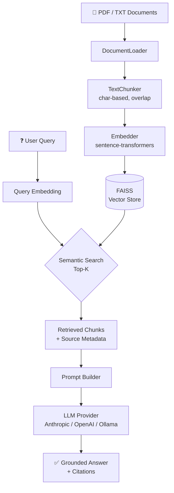

# RAG Pipeline Demo — Financial Document Q&A

> Production-ready Retrieval-Augmented Generation (RAG) system for querying financial documents. Portfolio project demonstrating senior AI/ML engineering skills.

**Author:** Jerzy Płocha | Senior Backend Architect → AI/ML Engineer  
**Stack:** Python · sentence-transformers · FAISS · LangChain-free · multi-provider LLM  
**Domain:** Financial services / Banking (Basel III, SEC filings, credit policy)

---

## 🎯 What This Demonstrates

| Skill | Implementation |
|-------|----------------|
| **Embeddings** | sentence-transformers/all-MiniLM-L6-v2 (runs locally, no API key) |
| **Vector search** | FAISS flat index with L2 normalization |
| **Chunking strategy** | Character-based with sentence-boundary aware overlap |
| **Prompt engineering** | Context-grounded prompt with source attribution |
| **LLM abstraction** | Pluggable provider: Anthropic / OpenAI / Ollama |
| **Production patterns** | Config layer, lazy loading, save/load index, proper logging |
| **Testing** | pytest suite covering chunker, embedder, retriever |

---

## 🏗️ Architecture



### Data Flow

```
Documents → Load → Chunk (1000 chars, 200 overlap)
         → Embed (384-dim vectors)
         → FAISS index (persisted to disk)

Query    → Embed → FAISS search (Top-5)
         → Context prompt → LLM → Answer + sources
```

---

## 🚀 Quick Start

### 1. Clone & install

```bash
git clone https://github.com/your-username/ml-portfolio.git
cd ml-portfolio

python -m venv venv
source venv/bin/activate  # Windows: venv\Scripts\activate

pip install -r requirements.txt
```

### 2. Configure LLM provider

```bash
cp .env.example .env
# Edit .env — choose your provider:
```

```env
# Option A: Anthropic Claude (recommended)
LLM_PROVIDER=anthropic
LLM_MODEL=claude-3-5-sonnet-20241022
ANTHROPIC_API_KEY=sk-ant-...

# Option B: OpenAI
LLM_PROVIDER=openai
LLM_MODEL=gpt-3.5-turbo
OPENAI_API_KEY=sk-...

# Option C: Ollama (fully local, no API key)
LLM_PROVIDER=ollama
LLM_MODEL=llama2
OLLAMA_BASE_URL=http://localhost:11434
```

> **Note:** Embeddings always run locally via sentence-transformers. Only the final generation step needs an API key (or Ollama for fully offline use).

### 3. Add documents & run

```bash
# Sample Basel III document is already included in data/
# Add your own PDFs or TXT files to data/ as needed

python -m src.main
```

### 4. Run tests

```bash
pytest tests/ -v
```

---

## 💬 Example Output

```
Question: What are the minimum capital requirements under Basel III?

Answer:
Under Basel III, banks must maintain the following minimum capital requirements:

1. Common Equity Tier 1 (CET1): minimum 4.5% of risk-weighted assets (RWA)
   — the highest quality capital (common shares + retained earnings)

2. Tier 1 Capital: minimum 6% of RWA
   — includes CET1 plus additional instruments meeting perpetual/subordinated criteria

3. Total Capital: minimum 8% of RWA
   — Tier 1 plus Tier 2 (subordinated debt and similar instruments)

Additionally, banks must hold a Capital Conservation Buffer of 2.5% CET1,
bringing the practical CET1 minimum to 7%.

**Sources:**
- basel_iii_overview.txt (chunk 1)
- basel_iii_overview.txt (chunk 2)
```

```
Question: What is the leverage ratio requirement?

Answer:
The Basel III leverage ratio is set at a minimum of 3%. It is calculated as:

    Leverage Ratio = Tier 1 Capital / Total Exposure

This non-risk-based measure was introduced to complement the risk-weighted
capital requirements by constraining build-up of leverage in the banking
sector and providing a safeguard against model risk and measurement error.
It became a Pillar 1 requirement in 2018.

**Sources:**
- basel_iii_overview.txt (chunk 4)
```

---

## 📂 Project Structure

```
ml-portfolio/
├── src/
│   ├── __init__.py
│   ├── config.py           # Centralised config (chunk size, model names, paths)
│   ├── document_loader.py  # PDF and TXT ingestion
│   ├── chunker.py          # Sentence-boundary aware text splitting
│   ├── embedder.py         # sentence-transformers wrapper
│   ├── vector_store.py     # FAISS index with save/load
│   ├── retriever.py        # Top-K semantic retrieval
│   ├── llm.py              # OpenAI / Anthropic / Ollama providers
│   ├── rag_pipeline.py     # End-to-end orchestration
│   └── main.py             # Interactive CLI entry point
├── tests/
│   ├── test_chunker.py     # Chunking logic tests
│   ├── test_embedder.py    # Embedding shape + similarity tests
│   └── test_retriever.py   # Retrieval relevance tests
├── data/
│   ├── README.md                # Dataset sources and instructions
│   └── basel_iii_overview.txt  # Sample: Basel III banking regulations
├── notebooks/
│   └── demo.ipynb          # Interactive end-to-end demo
├── docs/
│   └── architecture.md     # Deep-dive architecture notes
├── .env.example            # LLM provider config template
├── requirements.txt
├── .gitignore
└── LICENSE
```

---

## ⚙️ Configuration

All settings are in `src/config.py`:

```python
EMBEDDING_MODEL = "sentence-transformers/all-MiniLM-L6-v2"  # runs locally
CHUNK_SIZE      = 1000   # characters per chunk
CHUNK_OVERLAP   = 200    # overlap between adjacent chunks
TOP_K           = 5      # chunks to retrieve per query
LLM_TEMPERATURE = 0.7
MAX_TOKENS      = 500
```

LLM provider is set in `.env` (see Quick Start above).

---

## 🔧 Extending the Pipeline

### Use a different embedding model

```python
rag = RAGPipeline(
    embedding_model="sentence-transformers/all-mpnet-base-v2"  # 768-dim, more accurate
)
```

### Use ChromaDB instead of FAISS

Swap out `VectorStore` with a ChromaDB implementation — the `add_embeddings` / `search` interface is the same.

### Add a reranker

After FAISS retrieval, add a cross-encoder reranker before building the context prompt:

```python
from sentence_transformers import CrossEncoder
reranker = CrossEncoder("cross-encoder/ms-marco-MiniLM-L-6-v2")
```

---

## 🧪 Tests

```bash
pytest tests/ -v

# Expected output:
# tests/test_chunker.py::test_chunker_init         PASSED
# tests/test_chunker.py::test_chunk_short_text     PASSED
# tests/test_chunker.py::test_chunk_long_text      PASSED
# tests/test_chunker.py::test_chunk_documents      PASSED
# tests/test_chunker.py::test_chunk_overlap        PASSED
# tests/test_embedder.py::test_embedder_init       PASSED
# tests/test_embedder.py::test_embed_single_text   PASSED
# tests/test_embedder.py::test_embed_multiple_texts PASSED
# tests/test_embedder.py::test_embed_empty_list    PASSED
# tests/test_embedder.py::test_embedding_similarity PASSED
# tests/test_retriever.py::test_retriever_init     PASSED
# tests/test_retriever.py::test_retriever_retrieve PASSED
# tests/test_retriever.py::test_retriever_relevance PASSED
# tests/test_retriever.py::test_retriever_empty_store PASSED
```

---

## 👤 About

**Jerzy Płocha** — Senior Backend Architect transitioning to AI/ML Engineering

- 15 years building scalable financial systems (Citi, Deutsche Bank, Santander, Credit Suisse)
- AWS Solutions Architect certified
- Technical Reviewer: *Generative AI-Driven Application Development with Java* — Springer Nature (ISBN 979-8-8688-1609-3)
- Topics covered: Spring AI, LangChain4j, RAG, Ollama, vector databases, agentic workflows
- Currently: Stanford ML Specialization (Andrew Ng)

**Why this project exists:** Most AI/ML portfolio projects are toy examples. This one is structured as I would build it at a tier-1 bank — clean separation of concerns, proper configuration layer, testable components, no magic strings. The financial domain is deliberate: it's where I have 15 years of depth, and financial document Q&A is a real enterprise use case.

---

## 📝 License

MIT — see [LICENSE](LICENSE)
